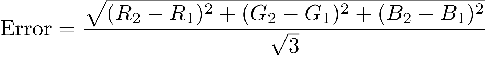

# image_difference
Python code to compute the color difference (with sign) between two images

## Usage

```bash
./image_difference <image1> <image2>  
```

Optional Parameters:  
```
	[-o <string>] output filename (default: rms.png)  
	[-s <float>] scale multiplier for difference  
	[-csize <float>] size of colorbar (default: 0.8)  
	[-cmap <string>] matplotlib colormap (default: 'RdBu')  
	[-num] print total difference  
	[-d <bool>] divergent error: difference values with sign (default: True)
	[-m {error_only, cbar_only, both}] output content (error and colorbar or only one component) (default: both)
	[-vmin <float>] Minimum value in the colorbar
	[-vmax <float>] Maximum value in the colorbar
```

## Examples
In the default mode of operation the code generates an image with the color difference between two images:
```bash
./image_difference.py image1.png image2.png  
```


However the error image has a different resolution than the original images, which is bothersome for visual comparison.
To solve this problem we can use the error_only mode, which produces an error image with the original resolution, without
any white border (padding):
```bash
./image_difference.py image1.png image2.png -m error_only
```


This is ideal to display the difference alongside the original images. If we also wish to show the colorbar, we need to generate it in a separate image file:
```bash
./image_difference.py image1.png image2.png -m cbar_only -o cbar.png
```

## Color difference computation

The color difference is computed as:



were the denominator is a normalization factor so that the maximum possible difference in a single pixel is 1 (which happens when
the pixel is pure white in one image and pure black in the other).
